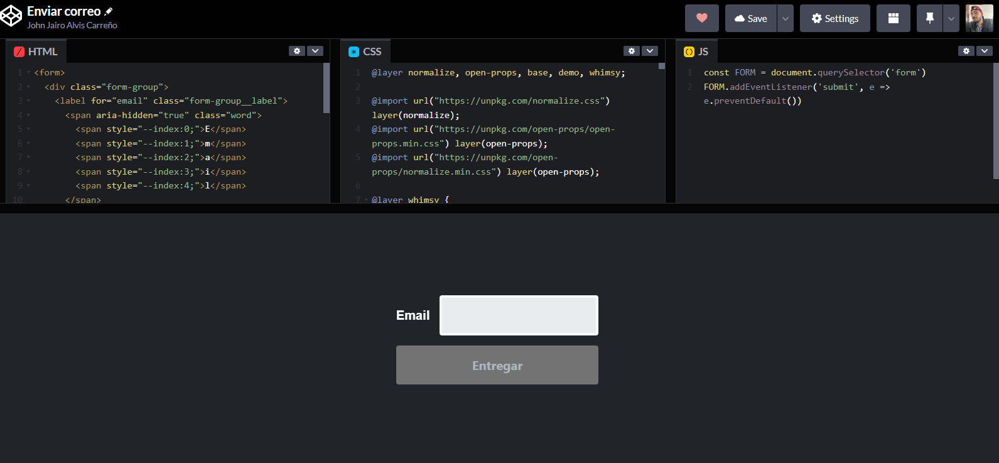
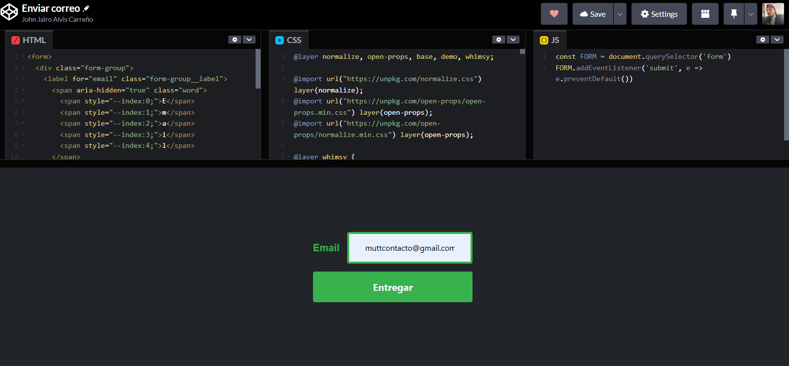
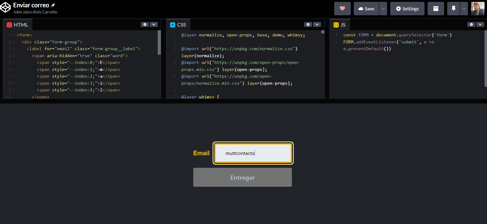

# Enviar correo
Muestro una de muchas formas de validar y enviar correos escalable con una animación moderna.

# Formulario de Captura de Correo Electrónico

Este formulario HTML permite a los usuarios ingresar y enviar su dirección de correo electrónico. A continuación, se detalla la estructura y los elementos principales del formulario.

## Descripción del Código

### Estructura del Formulario

- **Formulario (`<form>`)**: Contiene todos los elementos del formulario y el botón de envío.

### Campo de Correo Electrónico

- **Etiqueta (`<label>`)**: La etiqueta "Email" se divide en caracteres individuales, cada uno con un índice `--index`, lo cual permite estilos personalizados en cada letra.
- **Texto Alternativo (`sr-only`)**: Se incluye un `span` con la clase `sr-only` que muestra "Email" como texto alternativo para mejorar la accesibilidad, especialmente para lectores de pantalla.
- **Campo de Entrada (`<input>`)**: Este es el campo donde el usuario ingresa su dirección de correo electrónico. Incluye:
  - `required`: Indica que es un campo obligatorio.
  - `type="email"`: Asegura que el valor ingresado tenga formato de correo electrónico.
  - `title` y `placeholder`: Muestran mensajes orientativos en el campo.

- **Mensaje de Error**: Un mensaje de error se muestra en caso de que el usuario no ingrese un correo electrónico válido. El texto de error es "Introduzca una dirección de correo electrónico válida".

### Botón de Envío

- **Botón (`<button>`)**: El botón de envío, etiquetado como "Entregar", permite al usuario enviar el formulario. Puedes cambiar el texto a "Enviar" o "Enviar formulario" si lo prefieres.

## Ejemplo de Interfaz

Este es un ejemplo de la pantalla del formulario para la captura de correo electrónico. La imagen `login1.png` debe estar en la misma carpeta que este archivo `README.md` o en una ruta accesible.

## Personalización

Puedes personalizar este formulario añadiendo estilos CSS para cada letra en la etiqueta "Email" o cambiar el texto de los mensajes de error. Además, puedes adaptar el diseño para otros campos si se requieren capturas adicionales.

<!---
1.Inicio

2.Cuando un correo no es valido

3.Cuando se esta escribiendo el correo

4.Cuando el correo se valida

Ejemplo entro codigo 
https://codepen.io/johnjairoac/pen/qBJXBWZ
--->
